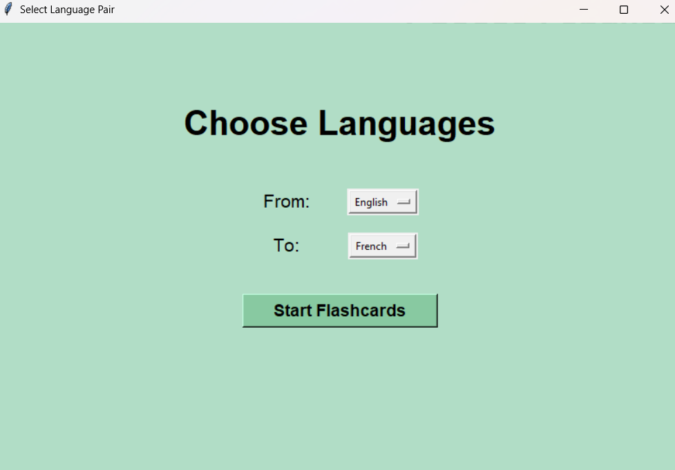
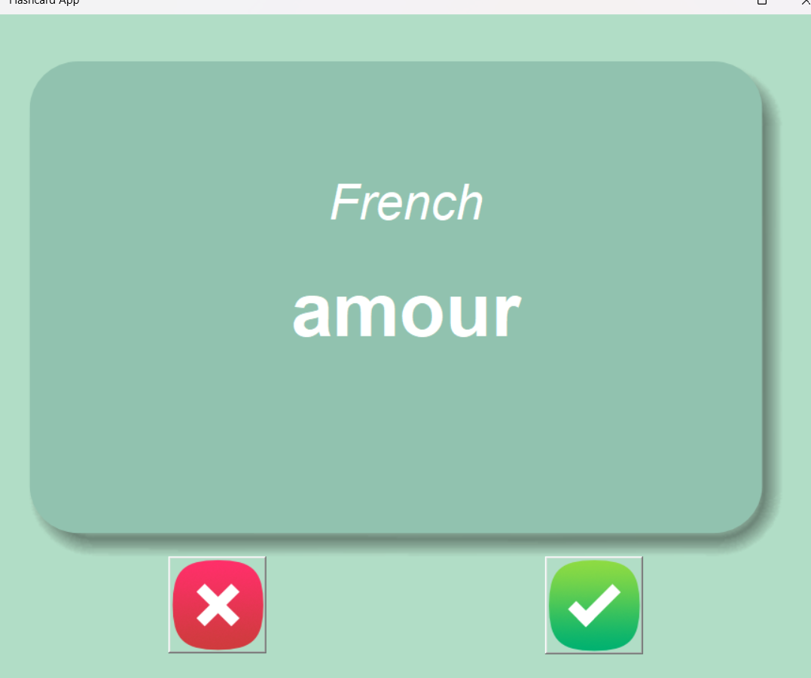

# 🌍 Multilingual Flashcards App

A modern, open-source flashcard app for mastering vocabulary in **Arabic, English, French, German, and Hungarian**.  
Built with Python and Tkinter, it offers a smooth and clean UI, supports all language combinations, and tracks your learning progress separately for each language pair.

> 🎯 Learn smarter. Remember longer. Collaborate freely.

---

## 🖼️ Preview

### 🔤 Language Selector  


### 🧠 Flashcard in Action  


> 📸 To display previews like these, place your screenshots in the `images/` folder.

---

## ✨ Features

- 🔄 Learn vocabulary between any two supported languages
- 🎯 Save learning progress *per language pair* (e.g. English → French)
- ⏳ Auto card flip after 3 seconds (spaced repetition)
- 📁 Uses editable CSV dictionaries
- 🖼 Consistent card layout and visual design
- 🧠 Focused learning: skips known words automatically

---

## 🚀 Getting Started

### 📦 Requirements

- Python 3.7 or later
- Tkinter (usually comes pre-installed with Python)

### ▶️ Run the App

```bash
git clone https://github.com/MazeRisaa/Multilingual-Flashcards.git
cd Multilingual-Flashcards
python main.py


Select your Source Language (what you already know)

Select your Target Language (what you want to learn)

Flashcards will start automatically using that pair

📁 Project Structure
bash
Copy
Edit
Multilingual-Flashcards/
│
├── main.py                   # Entry point
├── flashcard_app.py          # Flashcard logic and progress tracking
├── language_selector.py      # Dropdown UI for language choice
├── ui.py                     # Buttons, canvas, and animations
│
├── data/                     # CSV dictionaries by language pair
│   └── english_german_dictionary_fixed.csv
│
├── progress/                 # Automatically created to save user progress
│   └── words_to_learn_english_german.csv
│
├── images/                   # App assets and screenshots
│   ├── card_front.png
│   ├── card_back.png
│   ├── wrong.png
│   ├── right.png
│   ├── preview_language_selector.png
│   └── preview_flashcard.png
│
└── README.md
📊 CSV Format
Every translation CSV file in the data/ folder should follow this format:

Source Language	Source Word	Target Language	Translated Word
English	apple	French	pomme
Arabic	شمس	German	Sonne

Add your own word lists easily with Google Sheets or Excel and export as .csv.

🤝 Contributing
We welcome contributors of all levels!

🔧 Ideas to Work On
🔉 Add Text-to-Speech (TTS) for pronunciation

🌗 Add a Dark Mode

☁️ Add progress syncing via Firebase or Supabase

📱 Make a mobile version using Kivy or PyQt

📊 Show flashcard statistics (accuracy, speed)

🛠 How to Contribute
bash
Copy
Edit
# Fork this repo
# Create a new branch
git checkout -b feature/your-feature-name

# Make changes, commit, and push
git commit -m "Add new feature"
git push origin feature/your-feature-name

# Then open a Pull Request on GitHub
📝 License
This project is licensed under the MIT License.
Free to use, share, modify, and improve.

📬 Contact
GitHub: @MazeRisaa

Open an issue or pull request to suggest features or report bugs

